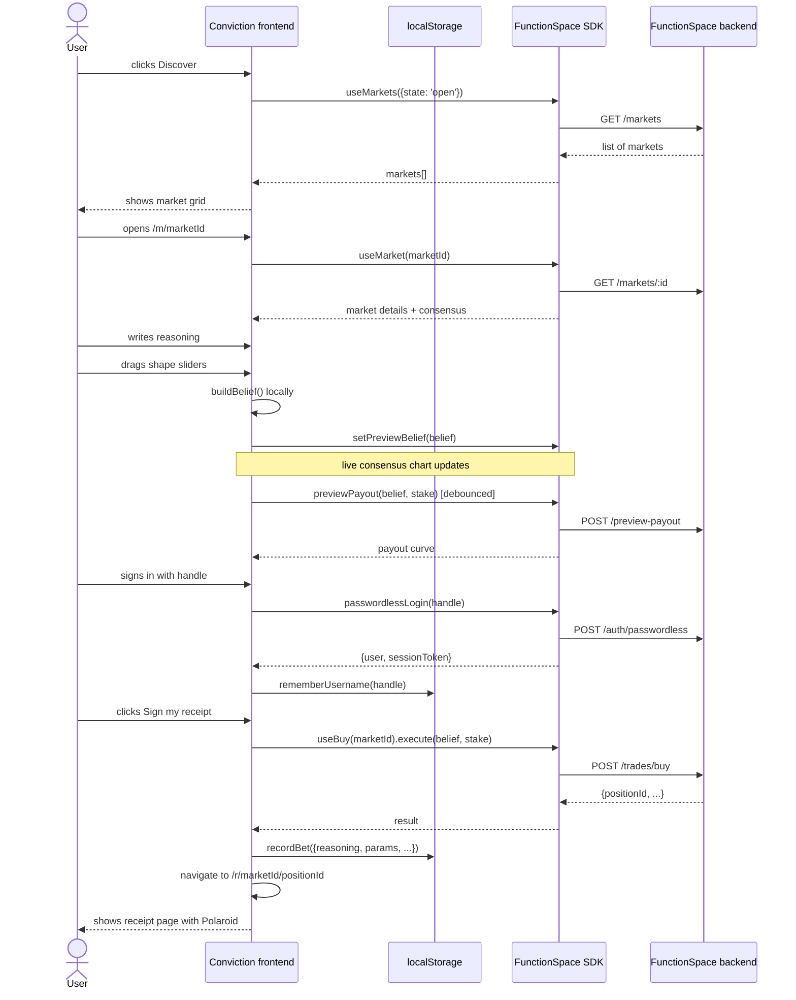
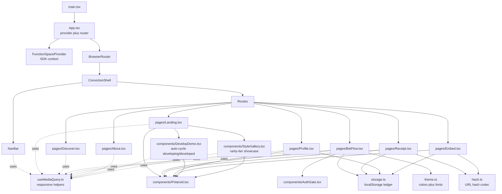
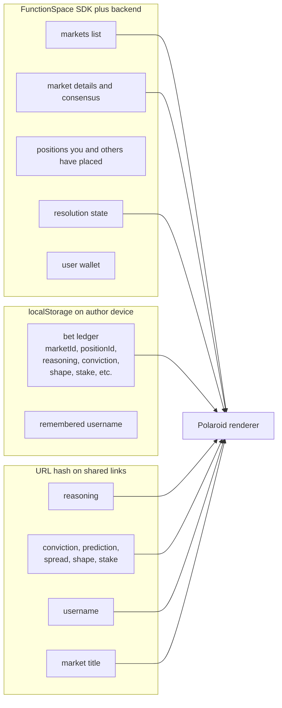
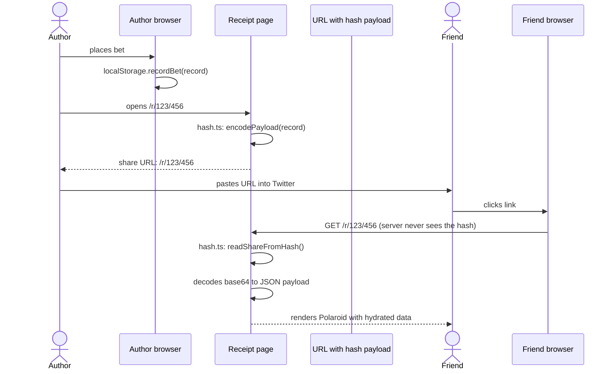
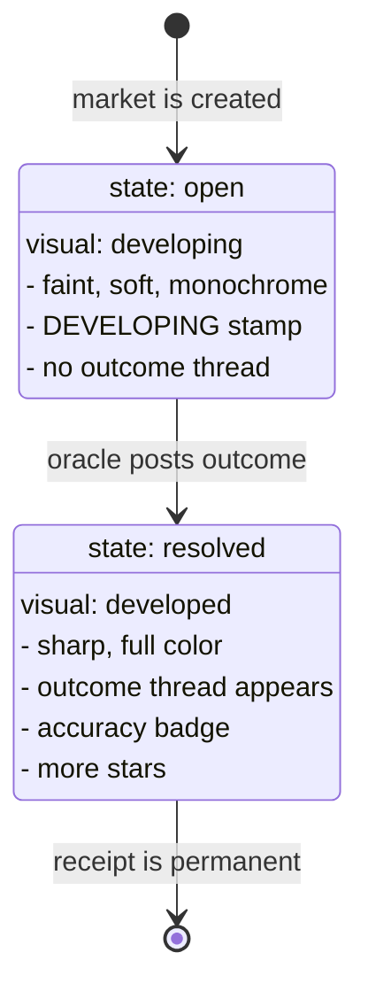
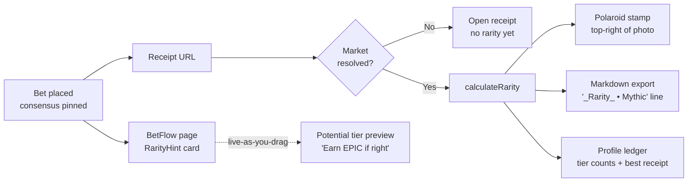

# Conviction

> A receipts-first prediction publication, built on the FunctionSpace Trading SDK.

This document explains Conviction from the highest abstraction (what it is, who it's for) all the way down to the lowest (which file does what, what data lives where, why each design decision was made). It assumes zero prior knowledge of the codebase or of prediction markets.

If you want to *use* Conviction, skip to **[How to run it](#how-to-run-it)**.
If you want to *understand* Conviction, read top to bottom.

---

## Table of contents

1. [What is Conviction?](#what-is-conviction)
2. [The problem it solves](#the-problem-it-solves)
3. [The product in 30 seconds](#the-product-in-30-seconds)
4. [The user journey](#the-user-journey)
5. [The Polaroid: anatomy of a receipt](#the-polaroid-anatomy-of-a-receipt)
6. [Polaroid art presets (procedural palette spectrum)](#polaroid-art-presets-procedural-palette-spectrum)
7. [Architecture](#architecture)
8. [Where data lives](#where-data-lives)
9. [The two killer mechanics](#the-two-killer-mechanics)
10. [File-by-file walkthrough](#file-by-file-walkthrough)
11. [SDK hooks we use](#sdk-hooks-we-use)
12. [How to run it](#how-to-run-it)
13. [Design choices and tradeoffs](#design-choices-and-tradeoffs)
14. [Competition rubric: how Conviction scores](#competition-rubric-how-conviction-scores)
15. [What is not done yet](#what-is-not-done-yet)
16. [End-to-end testing without spending a cent](#end-to-end-testing-without-spending-a-cent)
17. [Editorial polish pass (animation + voice + Markdown export)](#editorial-polish-pass-animation--voice--markdown-export)
18. [Rarity tier system (gamification)](#rarity-tier-system-gamification)

---

## What is Conviction?

Conviction is a website. You go to it, you find a question (called a "market"), you write down what you think the answer is and *why*, you put a small amount of money behind it, and the website hands you back a beautiful little image called a **Polaroid**. The Polaroid contains your prediction, your reasoning, your name, and the date. You can copy a link to it and share it anywhere.

When the real-world answer becomes known later, the Polaroid changes. It "develops": it sharpens up, color appears, and a thin line shows where the actual outcome landed compared to where you guessed. Your reasoning stays attached to it forever.

That is the entire product.

The phrase to remember is: **"the why is the asset."** Most prediction markets care only about whether you were right. Conviction also preserves *why* you thought you were right, because that is the rarer and more valuable thing.

---

## The problem it solves

Prediction markets are very good at one thing: aggregating people's opinions about the future into a single number (a probability or a value). They are extremely bad at preserving the reasoning behind any individual person's bet.

Today, if you bet that a movie will win Best Picture, the only thing the world records is "this anonymous wallet bought 25 dollars of YES at price X." If you turn out to be right, nobody knows it was you and nobody knows why you saw it before everyone else.

That is a tragedy because the *reasoning* a calibrated forecaster produces is the most valuable thing they make. It is what gets them invited to the next conversation. It is what teaches the next generation. It is what proves they were not just lucky.

Conviction fixes this by treating each bet as a small, beautiful, permanently shareable artifact that carries the reasoning with it.

---

## The product in 30 seconds

```mermaid
flowchart LR
    A[Land on the homepage] --> B[Browse Discover<br/>find an interesting market]
    B --> C[Open the bet flow page]
    C --> D[Write your reasoning<br/>shape your belief curve<br/>set your stake]
    D --> E[Sign in with just a handle<br/>no password no email]
    E --> F[Submit]
    F --> G[Get a permanent receipt URL<br/>r/marketId/positionId]
    G --> H[Share the link<br/>or copy the embed iframe]
    H --> I[Wait]
    I --> J[Market resolves]
    J --> K[Polaroid develops automatically<br/>everywhere it has been shared]
```



That is the loop. Notice that **you do not need an account** to read receipts. You only need a handle to *create* one. Notice also that the receipt link works on *any* device, even one that has never visited the site before, because the reasoning travels in the URL itself.

---

## The user journey

This is what actually happens, technically, when someone places a bet:



The crucial detail: **reasoning never leaves the user's device** unless they explicitly share the link. The FunctionSpace backend stores the *position* (the bet itself); only Conviction's `localStorage` and the share-URL hash store the *reasoning*. This is by design.

---

## The Polaroid: anatomy of a receipt

The Polaroid is the centerpiece. It is generated entirely in SVG inside the browser, with no images and no server. Every Polaroid is unique and deterministic: same parameters always produce the same picture.

Here is what every Polaroid encodes:

```
+------------------------------------+
|                                    |  <- white card body (palette.card)
|  +------------------------------+  |
|  |                              |  |
|  |    sky gradient              |  |  <- color palette is picked from
|  |                              |  |     prediction position and shape
|  |    *  *   stars   *          |  |
|  |        *      *              |  |  <- more stars after resolution
|  |                              |  |
|  |        ( SUN )    [actual]   |  |  <- pre-res: stamp at the outcome line
|  |                      |       |  |     post-res: small "actual" tag
|  |                      |       |  |
|  |  ____ /\  ___/\______|____   |  |  <- horizon silhouette IS the curve
|  | /    /  \/      \    |   \   |  |
|  |/____/____\_______\___|___\   |  |
|  |                  DEVELOPING  |  |  <- stamp before resolution
|  +------------------------------+  |
|                                    |
|       you · 4%                     |  <- prediction label (above axis)
|  +----+--*------------*----+--+    |  <- numeric scale strip
|  0     prediction      actual  100 |  <- bounds + outcome label below axis
|                  actual · 4.25%    |
|                                    |
|   "Market title here"              |  <- italic display font
|   the reasoning, truncated to      |  <- italic body font
|   about 110 characters max...      |
|                                    |
|   @handle · 4 % -> 4.25 % · off 0% |  <- mono footer reads as a sentence
|                      +83% CALLED   |  <- accuracy verdict on the right
|   MAY 10 2026 · CONVICTION × 8/10  |
+------------------------------------+
```

### The visual code

| Visual element | What it encodes | Where it comes from |
| --- | --- | --- |
| Sky color palette | Rarity + identity. The rarity tier picks a color region (sunset, twilight, aurora, goldleaf, oracle, …), and the per-receipt seed picks the exact hue / saturation / lightness inside that region. Rarer tiers get more saturated palettes; every receipt is one-of-one. | `paletteFor()` + `FAMILY_REGIONS` in `Polaroid.tsx`, family chosen by `pickPaletteFamily()` |
| Sun horizontal position | The X-position of the dominant *peak* of your belief density, not just the prediction value. For a single-peak Gaussian or a range plateau, the peak coincides with the prediction so the sun sits directly over the prediction marker. For a bimodal belief, the prediction value is the midpoint *between* the two peaks, so the primary sun sits over the bigger of the two density peaks at `prediction + 1.6 × spread` and a second smaller moon sits over the other peak at `prediction - 1.6 × spread`. The sun is therefore always centred on the hill it represents, never floating in a valley. | `primaryX / secondaryX` in `buildPhoto()` |
| Sun size | Conviction and stake. Higher conviction equals a bigger sun (up to +8% photo width on top of the base radius), and a larger stake adds up to another +8% via a `log10(collateral)` curve, so a $200 receipt has a visibly larger sun than a $5 one. | `sunR` in `buildPhoto()` |
| Second smaller sun (moon) | Appears only for bimodal beliefs. Sits over the smaller density peak at `prediction - 1.6 × spread`, with radius ≈ 0.72 × the primary's (matching the 0.5/0.7 density weight ratio). Reads as "the less-likely peak is the smaller moon." | `sun2` in `buildPhoto()`, `shape === 'bimodal'` |
| Horizon silhouette | Your full belief curve, stretched along the bottom of the photo. The peak of the silhouette is where you think the answer is most likely to be (one hill for single peak, plateau for range, two hills for bimodal). | `silhouettePath()` calls `densityAt()` |
| Ornament tick strip | The matte strip between the photo and the scale strip — a clear "weight gauge" for the stake slider. More dollars on the line means more ticks (3 at $1, 18 at $1000+), longer ticks (4–11 px), and bolder ticks (opacity 0.55→0.95). Drawn on the polaroid matte (not inside the photo) so it always contrasts cleanly with the cream/dark paper, regardless of which palette family is showing. | `ornamentCount / ornamentLen / ornamentOpacity / ornamentStroke` in the Polaroid render block |
| Stars | Decorative, but the density follows conviction (more conviction → starrier sky). The constellation pattern is seeded per-receipt, so two receipts at the same conviction get visibly different starfields. Stars never spawn directly under a sun or moon. | seeded by `seed ^ 0xabc123` |
| Film grain | Vintage feel. Always present. | `feTurbulence` SVG filter |
| DEVELOPING stamp | Visible until resolution. Like a Polaroid in the first 60 seconds. | `resolutionState !== 'resolved'` |
| Soft, faded, monochrome filter | Pre-resolution only. Applied via `feColorMatrix`. | `photoFilter` is `undefined` once `developed` is true |
| Sharp, full color, dashed outcome line | Post-resolution. The dashed line marks the actual outcome on the same horizontal range as the prediction, with a small "actual" tag at the top. | `developed === true && resolvedOutcome != null` |
| **Numeric scale strip** | Bottom of the card, between photo and caption. Shows lower bound, the user's prediction (labelled **you · X**), the outcome (labelled **actual · Y**, only when developed), and upper bound. The two markers sit on opposite sides of the axis so they never collide. | `ScaleStrip` in `Polaroid.tsx` |
| **Sentence-style footer** | `@handle · X → Y · off by Z%` once developed, `@handle · predicted X · $stake` when open. No more bare numbers without context. | `buildFooterSentence()` |
| Accuracy badge in footer | Computed from how close your prediction was to the outcome, given your spread. Returns `+X% CALLED IT`, `+X% CLOSE`, or `MISSED`. | `estimateAccuracy()` |

The whole thing is one big `<svg>` element, deterministic from inputs, rendered entirely with native SVG primitives (`<rect>`, `<circle>`, `<text>`, `<tspan>`, `<filter>`, gradients). The caption used to live inside a `<foreignObject>` for easy HTML/CSS layout, but Chrome taints any canvas that rasterizes an SVG containing a `<foreignObject>` (a longstanding security restriction), which silently broke the PNG export. The caption is now native SVG `<text>` with a small manual line-wrap helper, and a `<clipPath>` keeps anything that overflows hidden. Net result: identical visuals on screen, reliable PNG export in every browser.

The card aspect ratio is **3:2 (height = 1.5 × width)**. The photo is square; the scale strip is ~10% of the width tall (28-32 px); the caption area takes the rest. The reasoning is line-clamped to two lines and the title to one, so a long quote can never burst the bottom of the card. The reasoning is also character-capped relative to width (smaller cards truncate sooner) before line clamping kicks in, as a belt-and-suspenders against weird font fallbacks.

### How to read a Polaroid in five seconds

1. **Sun position** = where the user thinks the answer lives. Read it on the horizontal scale strip directly below.
2. **Mountain shape** = how confident they are. A sharp peak means narrow conviction; a wide hump means a broad range.
3. **Dashed line + "actual" tag** = where reality landed (only present once the market resolved).
4. **Footer sentence** = the same story in words: `4 % → 4.25 % · off by 0%`. The verdict on the right (`CALLED IT` / `CLOSE` / `MISSED`) is the "did the user win?" answer.

### Bug we fixed in this pass

Previous versions of the Polaroid built a develop filter conditionally — when the bet had resolved, the filter element was rendered with **no children**. SVG specifies that an empty filter outputs transparent, which silently blanked out the post-resolution photo: only the dashed outcome line was visible. Sample receipts and the `DevelopDemo` looked like empty white cards with one red dotted line. The fix is in two parts: (a) skip the `filter` attribute entirely when developed, (b) regression test in `tests/conviction/polaroid-render.test.tsx` that asserts the developed Polaroid does not carry the develop filter on its sky rect.

---

## Polaroid visual system: rarity-anchored, seed-varied

The Polaroid's visual is the receipt's identity. The previous iteration tried to surprise the user with eight randomly-rotated colour families — which is exactly what the user did not want: "when I literally move any of the sliders everything changes the background sky color, the sun color, the glow color every fucking thing is randomized." The current system is a complete rewrite of that: **rarity is the visual driver**, the seed only adds within-tier variation.

### The new contract

| Tier | Sky signature | Sun count | Frame | At a glance |
| --- | --- | --- | --- | --- |
| **Common** | Warm cream / sepia (hue ≈ 36°, low saturation 0.32) | 1 | 1px neutral | "Quiet receipt" |
| **Uncommon** | Jade green (hue ≈ 145°, moderate sat 0.52) | 1 | 3px jade | Contrarian-and-close |
| **Rare** | Cobalt / azure (hue ≈ 208°, sat 0.62) | 1 | 4px cobalt | Off-consensus and right |
| **Epic** | Royal violet (hue ≈ 272°, sat 0.66) | 1 | 5px violet | Bet against the crowd |
| **Legendary** | Amber / gold (hue ≈ 36°, sat 0.82) | **2** | 6px gold | Rare contrarian win |
| **Mythic** | Ember / crimson (hue ≈ 16°, sat 0.92) | **3** | 7px ember | "You saw the future" |

The rarity hue is the **anchor** for everything inside the photo: sky top, sky mid, sky bottom, sun glow, ground silhouette, ornament tick strip, even a sprinkle of "accent stars" that carry the tier colour in the constellation. The same hue ladder paints the rarity frame, the rarity stamp, the rarity hint in the bet flow, and the rarity pill in the profile gallery. Everything reads as one tier.

### What the seed still does

The seed (composed of market id, position id, username, reasoning text, prediction, spread, conviction, stake, shape, and createdAt) controls **within-tier** variation:

- Hue jitter inside the tier's signature band (±10-15°, never enough to escape the band).
- Saturation jitter (±0.07 absolute).
- Lightness ladder positions (sky top, mid, bottom).
- Sun placement: random `(x, y)` in the upper half of the photo with collision avoidance between suns. The sun does **not** track the prediction value any more — the user's prediction is already communicated by the silhouette hills and the numeric scale strip. The sun is the receipt's decorative signature, free to land wherever the seed puts it.
- Star pattern, count, and accent-star distribution.
- Silhouette jitter (per-receipt hills shape).
- Ornament tick density / length / opacity (stake-driven on top of seed).

The user explicitly asked for this split: "it should be either a gradient of colors corresponding to the rarity or whatever that makes sense and keeps the generated images always unique." Rarity supplies the gradient family; the seed supplies the uniqueness.

### Sun count is a tier signal, not a shape signal

Bimodal beliefs (two-hill silhouettes) used to draw two suns. That's gone. The user found it confusing: "the sun is always behind the center line of the curve and in bimodal the sune are not centered with the hills. Why? what does it mean?" The sun no longer encodes belief shape — the silhouette already does that. Instead:

- Common / Uncommon / Rare / Epic → one sun in a seed-driven random sky position.
- Legendary → two suns (a "main" sun plus a smaller companion, ~78% the radius).
- Mythic → three suns (main + two companions, ~78% and ~62% the radius).

Companion suns carry distinct hue rotations within the tier's accent band so the multi-sun layouts read as a celestial composition, not as cloned disks.

### Reasoning quote lives over the ground, never over the sky

The post-resolution reasoning quote is now anchored to `horizonY` and clipped to the ground area: `y = photoY + horizonY * photoSize + photoSize * 0.06`, `maxHeight = (1 - horizonY) * photoSize - photoSize * 0.10`. It can never spill upward over the hills, the suns, or the stars. The user fed back: "please make sure that the reasoning is always wrapped and fitted under the ground level so that the reasoning after resolution is not covering the hills and the sky but rather is always in the bottom half of the image covering only the ground and not covering the beautiful sky and hills and sun or moon or whatever it is." That is now a hard layout constraint.

### Live preview also tints

Open bets get a palette anchored to their **potential rarity** — the tier the user would land if they're right within ~3%. So as the user drags the prediction slider in the bet flow away from consensus, the live preview's sky shifts: from cream (common) toward jade (uncommon) toward cobalt (rare) toward violet (epic) toward gold (legendary) toward ember (mythic). The rarity stamp itself only appears on actually-resolved bets; the colour is the live preview cue.

### Where it lives in code

- Rarity → hue table: `RARITY_VISUAL` in `components/Polaroid.tsx`.
- Anchored palette generator: `rarityPalette(rarity, seed, conviction, developed)` in `components/Polaroid.tsx`. Returns sky, ground, sun cores, sun glow, and accent colour as `#rrggbb` strings.
- Stellar topology + placement: `rarityTopology()` and the placement loop inside `buildPhoto()` in `components/Polaroid.tsx`. Star count strictly increments by one per tier so the rarity ladder reads at a glance: 1 (common), 2 (uncommon), 3 (rare), 4 (epic), 5 (legendary), 6 (mythic). Each count decomposes into binary pairs plus singletons (e.g. mythic = `[2, 2, 1, 1]`) so the existing pair-placement code lights up the right number of slots, and the composition reads as a hierarchy of close pairs at distance rather than a crowded cluster.
- Celestial events scale monotonically with rarity, generated by the seed-derived `eventRng` in `buildPhoto()`:
  - Comets: 0 (common); 35% chance of 1 (uncommon); 65% chance of 1 (rare); 1 guaranteed (epic); 1-2 (legendary); 2-3 (mythic). Each comet is a bright head with a colored tail aligned to the rarity accent.
  - Nebula: appears at epic and intensifies through mythic (0.35 -> 0.55 -> 0.85 opacity), placed in the upper sky furthest from any star.
  - Aurora: appears at legendary as a single soft jade band; at mythic stacks three overlapping curtains in jade + magenta + the rarity accent for an out-of-this-world wash.
  Every event is deterministic via the seed, so re-renders / zooms never re-randomize.
- Reasoning quote anchor: see the `ReasoningQuote` callsite that uses `photo.horizonY` for `y` and `maxHeight`.
- Frame widths + glows per tier: `TIER_META` in `rarity.ts` (now 1 / 3 / 4 / 5 / 6 / 7 px).
- Effective rarity for live preview: `effectiveRarity` memo in the `Polaroid` component (resolved → actual, open → `potentialRarity`).
- Tier showcase UI: `components/StyleGallery.tsx`.

The legacy `pickPaletteFamily()` and `PaletteFamily` types in `polaroidSeed.ts` are kept for back-compat with stored share payloads but are no longer wired into the renderer.

This is value-additive visual generation, not a colour reskin. The rarity hue carries semantic meaning (how contrarian-and-correct the user was), and the seed varies the rendition so each receipt remains one-of-one inside its tier.

---

## Architecture

### Where Conviction sits in the larger repo

```
fs_trading_sdk/                   <- the SDK monorepo (NOT ours to change)
  packages/
    core/                         <- pure TypeScript, no React
    react/                        <- React hooks (useMarket, useBuy, etc.)
    ui/                           <- prebuilt React components
  demo-app/                       <- the example consumer app
    src/
      App_*.tsx                   <- starter kits we ignored
      conviction/                 <- OUR app lives here
      main.tsx                    <- imports ./conviction/App
```

The rule we follow: **Conviction does not modify the SDK packages.** It only consumes them. Everything new lives inside `demo-app/src/conviction/`.

### Inside the Conviction folder



**Key shapes you should hold in your head:**

- `App.tsx` is a *very thin shell*. It wires the SDK provider and the router, and that is it.
- `Polaroid.tsx` is the most important file. It is roughly 600 lines of pure SVG generation. Read it once, you will understand the project.
- The `pages/` directory is where most of the user-facing copy and layout lives.
- `storage.ts` and `hash.ts` are tiny glue files (under 100 lines each) that solve one problem each.

---

## Where data lives

This is the most important diagram in the document. **Different pieces of data live in different places, and the choice was deliberate for each one.**



### Why this split

| Data | Stored where | Why |
| --- | --- | --- |
| The bet (collateral, belief vector) | FunctionSpace backend | This is real money. The SDK is the source of truth. |
| The list of markets | FunctionSpace backend | Same. |
| Market resolution state and outcome | FunctionSpace backend | Comes from oracles. |
| The reasoning text | localStorage **and** URL hash | This is our novel layer. It has to survive the user closing the tab (localStorage), and it has to travel to other people's devices (URL hash). |
| Conviction level, shape, prediction, spread | Same as reasoning | These are visual parameters used by the Polaroid renderer. They are not strictly necessary to reconstruct the bet (the SDK has the belief vector) but storing them ourselves means we do not have to round-trip the SDK to render the receipt. The procedural palette derives from these values together with the rest of the seed inputs, so storing them locally guarantees the same share link always paints the same colors. |
| Username preference | localStorage only | So returning visitors do not have to re-type. |

**Critical insight:** the FunctionSpace backend never sees a user's reasoning. That data is entirely client-side. If the user clears their browser and never shared the link, the reasoning is gone. This is a feature: it makes the product trivially compliant with privacy expectations and removes any need for our own backend.

---

## The two killer mechanics

These are the two things that make Conviction different from any other prediction market UI.

### 1. Hash-portable reasoning

Problem: a prediction-market platform that requires you to log in to see someone else's bet is dead on arrival on social media. Nobody clicks links that need an account.

Solution: when the author copies the share link, the entire reasoning payload gets base64-encoded into the URL hash (`#r=<base64>`). Browsers never send hash fragments to servers, so this is a serverless way to make data travel with a link.



The encoding is base64url (URL-safe alphabet), and the codec round-trips through `unescape(encodeURIComponent())` to handle multi-byte characters. See `hash.ts`, lines 23 to 49.

### 2. The photo develops

Problem: a static receipt is a snapshot. A receipt that updates when reality catches up is a story.

Solution: the Polaroid reads the live `market.resolutionState` from the SDK and renders two different visual states.



Critically, this happens *automatically*. Because the receipt page always calls `useMarket(marketId)` to get the latest state, every visit to a shared link reflects the current resolution state. Polaroids that someone shared months ago will look different the next time someone clicks them, with no maintenance.

---

## Four flagship features (2026-05-14 afternoon ship)

Each of the four features below is a self-contained module: a pure-function file under `demo-app/src/conviction/`, a UI component that consumes it, and a dedicated test file. None of them depend on the others; failing or unsupporting any one of them never affects the rest of the receipt flow.

(A fifth widget, the Convex-Hull Frontier on Discover, briefly shipped alongside these four. It was removed on 2026-05-17 after user feedback that the empty / sparse states felt like a dead surface and the visualisation did not communicate clearly enough to keep. The math module and all of its dedicated tests were deleted at the same time.)

### 1. Conviction Streak Halo · `streak.ts` + `components/StreakHalo.tsx`

A concentric SVG ornament rendered around the user's handle in the NavBar. The current-streak length is computed from the local rarity ledger as the longest run of resolved-and-accurate bets ending at the most recent resolution. Five visual tiers escalate the treatment: tier 0 renders nothing, tier 1-2 a thin warm-up ring, tier 3-5 a single ring with an outer glow, tier 6-9 two concentric rings, tier 10+ adds an orbiting comet via a CSS keyframe. Pure-derived from `getBetsByUser` + `calculateRarity`; no engine call.

### 2. Receipt for Receipt · `challenge.ts`

A "Challenge this call →" button renders on someone else's receipt when the viewer is signed in and the market is still open. Clicking it builds `/m/:marketId?challenge=<base64>` with the original payload, navigates there, and the BetFlow page decodes the param and pre-fills the form: prediction = mirror reflection across consensus (clamped to bounds), reasoning = Markdown blockquote of the original author, conviction = 0.5 (neutral), shape = original's shape. An eyebrow flips from `STAKE A CONVICTION` to `CHALLENGE @author` so the challenger knows what mode they're in. Malformed payloads decode to null and BetFlow falls back to default seeding.

### 3. Live Calibration Leaderboard · `calibration.ts` + `pages/Leaderboard.tsx`

A new `/leaderboard` route ranks every author whose bets have settled by `calibration = 1 - mean(|conviction - accuracy|)`. Data sources combine localStorage history (cross-referenced with `useMarkets` resolutions for outcome data) plus the demo galleries' baked-in `__demoOutcome` values, so the page is never empty even on a clean install. Sort order is score DESC, sample-count DESC, username ASC for stable rankings. Each row links to `/u/<handle>`. The choice of metric (mean absolute calibration error, rather than Brier or log-loss) is the simplest one that works for continuous accuracy values without thresholding.

### 4. Receipt-as-NFT (no chain) · `receiptNft.ts` + `components/VerifiedReceiptBadge.tsx`

Every conviction the user posts is signed at bet time with a per-device Ed25519 keypair stored in localStorage. The signature covers a canonical fingerprint of the receipt (marketId, positionId, username, prediction, conviction, collateral, spread, shape, reasoning, createdAt — keys sorted alphabetically, floats rounded to 6 decimals to dodge cross-browser drift). The Receipt page re-derives the live fingerprint on render and verifies it against the stored signature, surfacing one of five verdicts: `verified` (jade pill + 8-char fingerprint), `tampered` (rose pill — fields changed since sign), `invalid` (rose pill — signature failed Ed25519 verify entirely), `unsigned` (muted pill — older receipts or hosts without Ed25519), `unsupported` (muted pill — host doesn't expose Ed25519 in Web Crypto). The signing pipeline is purely additive: signing failure short-circuits to "no signature recorded" without affecting the rest of the bet flow.

## File-by-file walkthrough

Every file in `demo-app/src/conviction/`, what it does, what to look at first.

### `App.tsx` (about 100 lines)

The shell. Wraps `FunctionSpaceProvider` (gives all the SDK hooks access to config) around a `BrowserRouter`. Renders the `NavBar` and matches routes to pages. Has a special case for `/embed/*` paths that strips out the chrome.

**Read first:** the `fsConfig` constant. That is where the FunctionSpace baseUrl gets pulled from `.env`.

### `theme.ts` (about 45 lines)

Two exports:
- `convictionTheme` is the SDK's theme object. The SDK uses it to color its built-in components (like `ConsensusChart`) so they match.
- `palette` is our own object of named colors used directly in inline styles throughout Conviction.

**Read first:** the `palette` exports. Every component uses these.

### `storage.ts` (about 110 lines)

A tiny localStorage wrapper. Exports `recordBet`, `getBet`, `getAllBets`, `getBetsByUser`, `rememberUsername`, `recallUsername`, `forgetUsername`. Stores everything under two keys (`conviction.v1` and `conviction.username`).

**Read first:** the `BetRecord` interface. That is the shape of every bet we keep.

### `hash.ts` (about 80 lines)

The URL-hash codec. Exports `encodePayload`, `decodePayload`, `readShareFromHash`, `buildShareUrl`, `buildEmbedUrl`. Uses base64url with explicit UTF-8 round-tripping so multi-byte characters survive.

**Read first:** the `SharedPayload` interface. That is what gets put into the URL.

### `components/Polaroid.tsx` (about 700 lines)

The receipt renderer. Pure SVG, deterministic from inputs. Takes a `PolaroidProps` object and produces a single `<svg>` element of any width.

**Read first:** the `PolaroidProps` interface, then `buildPhoto()`, then `pickPalette()`, then `silhouettePath()`. In that order.

Three procedural sub-functions to know:
- `densityAt(x, opts)`: returns a non-negative number that is the height of the belief at position `x`. Branches on `shape` (gaussian, range, or bimodal). This is what makes the silhouette a function of the bet shape.
- `paletteFor()`: builds a unique palette from `(family, seed, rarity, conviction)`. The family chooses a hue region (e.g. sunset, twilight, aurora, goldleaf, oracle); the seed picks the exact hue/sat/lightness inside that region. Rarer tiers get more saturated palettes and steeper sky-top-to-bottom contrast.
- `mulberry32(seed)`: deterministic pseudo-random number generator. Seeded from `marketId:positionId` so the same receipt always gets the same stars.

Also exports `PolaroidPreset` (legacy union type kept for binary compatibility with shared links written before the procedural palette landed; the renderer ignores it).

### `components/DevelopDemo.tsx` (about 200 lines)

The marketing widget on the Landing page that auto-cycles a single Polaroid between developing and developed states every 4 seconds, with manual click-and-toggle override and an animated "what changed" diff list. Exists because every live market is `open`, so visitors otherwise never see the develop magic.

### `components/StyleGallery.tsx` (about 110 lines)

Horizontal scroll gallery on the Landing page showing the same bet rendered at all six rarity tiers. Each tier's palette region is visually distinct, so the gallery lets visitors feel the rarity → palette intensity scale at a glance without needing to open the bet flow.

### `components/NavBar.tsx` (about 150 lines)

Sticky top bar with a wordmark, a nav (Discover, My Convictions, About), and either the user identity (handle plus wallet plus sign-out) or a "Guest mode" tag. Reads from `useAuth()`. Compresses gracefully on narrow viewports (subtitle hides, "My Convictions" becomes "Mine").

### `components/AuthGate.tsx` (about 130 lines)

A custom-styled passwordless login form, used inline on the bet page when the user is not signed in. Wraps `useAuth().passwordlessLogin()` to avoid the SDK's default modal because it does not match the editorial vibe.

### `useMediaQuery.ts` (about 35 lines)

SSR-safe hooks for responsive layout decisions. Exports `useMediaQuery(query)`, `useIsMobile()` (≤900 px), and `useIsNarrow()` (≤560 px). Used by every page to swap between desktop and mobile layouts inside inline styles.

### `pages/Landing.tsx` (about 270 lines)

The homepage. Big serif headline, three "Floating Polaroid" mock receipts on the right, a three-step explainer below the fold. Mocks are hardcoded here so the homepage looks alive even before any real data loads.

### `pages/Discover.tsx` (about 275 lines)

The market browser. Uses `useMarkets({state: 'open', sortBy: 'totalVolume'})` to fetch live markets. Pill filters (Pop culture, Social, Sports, Politics, Tech, Crypto, Macro) work on a regex over the market metadata. The first market becomes a "Featured" hero card; the rest go into a grid.

### `pages/BetFlow.tsx` (about 490 lines)

The biggest page. Three-step bet form on the left, live Polaroid preview on the right.

The interesting bit is the live preview: it builds a `BeliefVector` from the current sliders on every change, calls `ctx.setPreviewBelief()` on the SDK context to make the consensus chart show your shape overlaid, and debounces a `previewPayout()` call to show your max possible payout. None of this hits the wire until the user actually submits.

On submit, it calls `useBuy(marketId).execute(belief, collateral)`, captures the returned `positionId`, calls `recordBet()` to localStorage, and navigates to `/r/marketId/positionId?fresh=1`.

**Read first:** the `buildBelief()` callback. That is where `shape`, `prediction`, `spread`, `secondPeak` get turned into a SDK belief vector by calling `generateGaussian`, `generateRange`, or `generateBelief` from `@functionspace/core`.

### `pages/Receipt.tsx` (about 380 lines)

The shareable single-receipt page. Renders the Polaroid at large size, the reasoning as a pull quote, stats, the live consensus drift card, the cash-out panel, and the share/embed copy buttons.

The hydration logic is the interesting part: `merged` is computed from `local ?? hydrate(fromHash, market) ?? null`. Local takes priority because it is the freshest. Hash payload is only used when the visitor does not have the bet in their own ledger. This way the page works for the original author *and* for every recipient of a shared link.

`useMarket(marketId, { pollInterval: 5_000 })` keeps the live consensus drift card and the eventual resolution stamp fresh while the receipt is open. The rarity-determining `consensusAtBet` snapshot is **NOT** mutated by the poll — it stays pinned to the value at bet time so rarity is stable across reloads.

### `components/LiveConsensusCard.tsx` (about 230 lines)

A small card rendered next to the polaroid stats on the Receipt page. Subscribes to `useMarket` on a 5 s poll. While the market is open, shows three rows:

- Consensus now (live μ)
- At bet time (pinned `consensusAtBet`)
- Drift (signed Δ as % of range, color-coded jade if the crowd is moving toward your prediction, ember if drifting away)

When the market resolves, the card pivots to a SETTLED outcome panel showing the final outcome, the user's call, and the absolute error band.

### `components/CashOutPanel.tsx` (about 270 lines)

The cash-out flow. Rendered on the Receipt page only when the viewer is the bet author AND the market is still open AND the position has not already been cashed out. Exercises two SDK hooks Conviction did not previously use:

- `usePreviewSell(marketId).execute(positionId)` for mark-to-market, polled every 10 s, used to display "Current sell value" and "Unrealized P&L".
- `useSell(marketId).execute(positionId)` to actually close the position.

The confirm flow is two-stage so accidental clicks do not close a position. On success the panel writes a `CashOutRecord` to `localStorage` via `recordCashOut()`, fires `onCashedOut` upstream so the parent stamps a "CASHED OUT" rubber-stamp overlay on the polaroid, then collapses to a static "received / staked / realized P&L" summary.

### `components/CashedOutStamp.tsx` (about 100 lines)

Pure presentational overlay: an angled, red-ink "CASHED OUT" rubber stamp drawn over the polaroid once a position has been sold. Sized as a fraction of `polaroidWidth` so the stamp scales cleanly across the receipt, profile, and embed views. The secondary line shows the realized P&L (or "BREAK EVEN").

### `components/LivePortfolioSection.tsx` (about 260 lines)

One section per market on the owner's profile page. Subscribes to `useMarket(marketId, { pollInterval: 15_000 })` and uses `usePreviewSell(marketId)` to mark every open position in that market to the engine's current sell-side payout. Polls every 15 s while the tab is visible. Each polaroid thumbnail gets a corner P&L badge (jade for gain, rose for loss). The section header aggregates STAKED, VALUE, and UNREALIZED P&L across the positions.

### `pages/Profile.tsx` (about 280 lines)

Two distinct surfaces:

1. **Live portfolio** (own profile only): groups the user's OPEN bets by market and renders one `LivePortfolioSection` per market for live mark-to-market.
2. **The archive**: every settled receipt (and, for non-owner views, every receipt), rendered as a grid of static `BetTile`s.

Pulls bets from `getBetsByUser()`. The owner-only live block reads the latest position values from the engine; the archive is purely a localStorage render. That means **profiles are still device-local** for the static archive piece. If you bet on your laptop and check your profile on your phone, your phone shows zero bets. (See [What is not done yet](#what-is-not-done-yet).)

### `pages/Embed.tsx` (about 110 lines)

A bare iframe-friendly version of the receipt. No nav, no chrome. Renders just the Polaroid and a tiny "POWERED BY CONVICTION" link. Hydrates from URL hash first, falling back to localStorage. The Polaroid links out (`target="_top"`) to the full receipt page.

### `pages/About.tsx` (about 100 lines)

The editor's note. Plain text explanation of the why, plus a list of editorial principles. No data, no logic, just copy.

---

## SDK hooks we use

This is the entire surface area of the FunctionSpace SDK that Conviction touches. Knowing this list is enough to understand the integration.

| Hook / function | Where used | What it does |
| --- | --- | --- |
| `FunctionSpaceProvider` | `App.tsx` | Provides config and theme to all child hooks. Required wrapper. |
| `useAuth()` | `NavBar`, `AuthGate`, `BetFlow`, `Profile`, `Receipt` | Returns `{user, isAuthenticated, passwordlessLogin, logout, loading, error}`. |
| `useMarkets(opts)` | `Discover`, `Profile` | Returns the live list of markets, with polling. |
| `useMarket(id, {pollInterval})` | `BetFlow`, `Receipt`, `Embed`, `LiveConsensusCard`, `LivePortfolioSection` | Returns one market's full state. The Receipt page polls every 5 s for the live drift card; the portfolio polls every 15 s; the rest fetch once. |
| `useBuy(id)` | `BetFlow` | Returns `{execute, loading, error}` for placing a buy. |
| `usePreviewPayout(id)` | `BetFlow` | Returns `{execute}` for getting a payout curve without trading. |
| `usePreviewSell(id)` | `CashOutPanel`, `LivePortfolioSection` | Returns `{execute}` for getting the current sell-side payout for an open position without trading. Drives the live "Unrealized P&L" on the Receipt page and the live portfolio P&L badges on the profile. |
| `useSell(id)` | `CashOutPanel` | Returns `{execute}` for closing a position. Powers the Receipt page's cash-out flow; on success the SDK auto-invalidates the market cache so the live drift card and the archive reflect the closed state. |
| `useTradeHistory(id, {limit, pollInterval})` | `TheWire` | Returns the recent trade ledger for a single market `{trades, loading, error, refetch}`. The Wire on the Discover page subscribes to the top three highest-volume markets and merges their feeds on the client so the visitor sees other users' BUYs and SELLs ticking through in real time, each row coloured by the potential rarity the trade could earn against current consensus. This is the social-proof loop the engine made possible. |
| `useMarketHistory(id, {limit, pollInterval})` | `ConsensusDriftSparkline` | Returns historical snapshots of one market `{history, loading, error}`. The Receipt page renders a compact SVG sparkline of the consensus mean over time (built via the pure `transformHistoryToFanChart` helper from `@functionspace/core`), overlaid with the user's prediction reference line and a "you signed here" caret. The sparkline also exposes a Play/Pause replay control that animates the historical mean across 4.8 s — a "flip-book" of how the crowd's belief evolved between the user's signing and now. Turns the receipt from "your single moment in time" into "your moment in the wider arc of crowd opinion." |
| `useConsensus(id)` | `LivePortfolioSection`, `ComparisonPair` | Returns the current consensus density `{consensus: {points, config}, loading, error}`. `ComparisonPair` reduces the density to mean + stdDev + conviction via `summariseConsensus` (trapezoidal integration) so the Receipt page can synthesise a "crowd polaroid" side-by-side with the user's — the editorial-payoff visual that asks "what would a polaroid look like if the CROWD signed a receipt today?" |
| `FunctionSpaceContext` | `BetFlow` | Direct context access for `setPreviewBelief` and `setPreviewPayout`. These let us paint the user's draft belief on the SDK's `ConsensusChart` before they submit. |
| `ConsensusChart` (from `@functionspace/ui`) | `BetFlow` | Prebuilt chart of the current market consensus. We pass it the `marketId` and the SDK takes care of the rest. |
| `PasswordlessAuthWidget` (from `@functionspace/ui`) | `NavBar`, `AuthGate` | The competition-required auth surface. Visually reconciled via CSS-only overrides (no React-tree changes) to match the editorial palette. |
| `generateGaussian`, `generateRange`, `generateBelief` (from `@functionspace/core`) | `BetFlow` | Pure functions that turn shape parameters into the discrete bucket vector the SDK requires for trades. |
| `transformHistoryToFanChart` (from `@functionspace/core`) | `ConsensusDriftSparkline` | Pure helper that normalises raw `MarketSnapshot[]` (with their alpha vectors) into a time series of `{timestamp, mean, mode, stdDev, percentiles}` points. Down-samples to a target point count for performance. |

That is the full SDK surface area Conviction touches — 12 hooks plus the two UI widgets and three core helpers. Everything else is our own code.

### How polling stays cheap

`useMarket` and `usePreviewSell` are both built on the SDK's cache+subscription model:

- The cache key for `useMarket` is `['marketState', marketId]`. Any number of subscribers on the same market share one in-flight request.
- The cache key is also used by `useConsensus`, which means turning on a poll interval anywhere (e.g. the Receipt page's `LiveConsensusCard`) keeps **every** subscriber on that market fresh, including the `ConsensusChart` on a nearby BetFlow tab.
- The SDK pauses polling for backgrounded tabs via `subscriberActivity`, so a forgotten tab does not keep banging the engine.
- `useBuy` / `useSell` call `invalidate(marketId)` on success, which fans out to every active subscriber so the UI reflects the new state immediately.

---

## How to run it

### Requirements

- Node 18 or newer
- A `.env` file at the workspace root containing the FunctionSpace base URL:

```
VITE_FS_BASE_URL=https://...
```

### From a fresh clone

```bash
npm install
cd demo-app
npx vite
```

That starts the dev server on `http://localhost:5173/` with hot reload.

### To build for production

```bash
cd demo-app
npx vite build
```

Output goes to `demo-app/dist/`. The bundle is currently around 200 KB gzipped (includes Recharts and react-router).

### To check types

```bash
cd demo-app
npx tsc --noEmit
```

---

## Design choices and tradeoffs

These are the decisions that shaped the codebase. Each one had alternatives. Knowing why we picked the way we did will help you decide whether to keep, change, or reverse them.

### 1. No backend

Conviction has zero backend code. Everything that is not in the FunctionSpace SDK lives in the browser: localStorage for the ledger, URL hashes for the shared payload, and SVG for the receipts.

**Tradeoff:** profiles are device-local (a bet on your laptop is not visible on your phone) and reasoning can be lost if the user clears their browser before sharing the link.

**Why we accepted it:** speed. Zero infra means we can ship the demo today, every receipt is reproducible from a URL, and we trivially comply with privacy expectations.

### 2. SVG, not canvas, for the Polaroid

The whole receipt is one `<svg>` element rendered with native SVG primitives only (no `<foreignObject>`) so the same SVG that renders on screen also rasterizes cleanly to a PNG without tainting the canvas.

**Tradeoff:** SVG is verbose. The Polaroid component is around 620 lines, most of which is markup.

**Why:** SVG renders crisply at any size, scales to retina displays, can be inlined into HTML, and most importantly is trivially screenshottable into a PNG by anyone (DevTools, browser screenshot tools, social media auto-render). Canvas would have required us to ship rasterized images.

### 3. Inline styles, not Tailwind, not CSS modules

Every component uses inline `style={{...}}` objects.

**Tradeoff:** no media queries by default (have to be added via the `<style>` tag at the document level or inline media-aware logic).

**Why:** colocation. The whole Polaroid render and every page can be read top to bottom without context-switching to a separate file. For a small editorial app this is the right call.

### 4. localStorage, not IndexedDB

We store bets as JSON in a single key.

**Tradeoff:** ~5 MB quota, synchronous API.

**Why:** the data is small (each record is a couple of hundred bytes), the access pattern is page-load read once, and IndexedDB's API would have added 50 lines of boilerplate for no real benefit.

### 5. Custom AuthGate, not the SDK's modal

We re-implement the login form inline.

**Tradeoff:** we have to re-do the form if the SDK adds a feature (like email codes).

**Why:** the SDK's modal is for terminal-style apps. Conviction is a publication. The auth has to feel like signing a guest book.

### 6. Reasoning is required, not optional

The submit button is disabled until the textarea has content.

**Why:** the entire product proposition collapses if you can sign a receipt without a why. We accept the friction.

### 7. Conviction is one of the bet parameters, not just metadata

The "Conviction x N/10" badge gets stored alongside the bet and influences the Polaroid's sun size.

**Why:** it is the brand promise (Conviction). Putting it visibly on the receipt forces users to decide explicitly how much they are putting their reputation behind a call, separately from how much money.

---

## Competition rubric: how Conviction scores

Conviction is built for the FunctionSpace Vibecoding Competition (4 to 18 May 2026). The judging rubric is public and surprisingly opinionated:

- **50% Usefulness** ("would a real person actually use this?")
- **40% Creativity** ("non-obvious application of the belief market primitive")
- **10% Market Selection** ("non-obvious or creative market choice")
- **0% Technical complexity** (explicitly stated)

Disqualified: "color palette reskins only of the 20 reference widgets."

### Submission readiness pass (May 2026, third batch)

The previous passes shipped product. This pass shipped *eligibility*. Two compliance issues and a submission package were the only things between the build and being ready to push to a fork.

**Compliance fixes (hard guardrails from the competition setup guide):**

- **Authentication.** The setup guide says "Always use `PasswordlessAuthWidget` from `@functionspace/ui`. No custom auth flows." The previous `AuthGate` was a custom passwordless form that called the SDK's `passwordlessLogin` function — math layer correct, widget layer custom. Replaced the form with the SDK widget directly, kept the editorial wrapper (the "Sign your conviction." headline and tagline) so the brand identity survives. File: `demo-app/src/conviction/components/AuthGate.tsx`.
- **Dev port.** The setup guide says default to `localhost:3000` and "do not fall back to port 3001 or any other port." Vite's default is 5173. Pinned the dev and preview servers to port 3000 with `strictPort: true` so a port conflict fails loudly instead of silently dropping to a different port. File: `demo-app/vite.config.ts`.

**Submission package:**

- `SUBMISSION.md` at the repo root. Copy-paste-ready answers for every form field on `https://ecosystem.functionspace.dev/competition/submit`, the short and long pitches, the 75-second demo video script, the judging argument, and the SDK compliance checklist.
- `vercel.json` and `netlify.toml` at the repo root. One-click deploy to either platform. Both inject `VITE_FS_BASE_URL` at build time so the deploy is a true zero-config push.
- `README.md` updated. The fork's public README now leads with Conviction (with surface map and run instructions) and preserves the SDK documentation below as a sub-section so judges can verify the build is on top of the SDK.
- A short curated market list pulled live from `https://fs-engine-api-dev.onrender.com/api/views/markets/list` and embedded in `SUBMISSION.md`. Editorially picked across pop culture, sports, AI, politics, climate, crypto.

**Verification:**

- `npx tsc --noEmit` (demo-app): clean
- `npx vite build`: clean (713 KB JS, 207 KB gzipped)
- `CONVICTION_SKIP_LIVE=1 npx vitest run tests/conviction` (Conviction suite): **489 passed / 5 live smoke tests skipped across 37 files**. An uns skipped live run currently reaches the dev engine but fails 2 smoke assertions because `/api/views/markets/list` includes a market item without `alpha_vector`; the receipt sizing regressions pass locally and do not depend on that backend response.
- Desktop receipt layout: fixed the `/r/:marketId/:positionId` two-column grid so long title and metadata content cannot force the polaroid column off-screen. The desktop grid now uses `minmax(0, 1fr) minmax(0, 380px)`, preserving the full 380 x 570 SVG artifact at 1024px desktop widths. Regression coverage lives in `tests/conviction/receipt-fallback.test.tsx`, and a real Chromium check against `/r/26/m26_pos_2212` confirms `document.scrollWidth === viewport width`, the polaroid frame sits fully inside the viewport, the photo is square, and the caption text is present.
- Vercel production deploy rebuilt from this repository and aliased to `https://conviction-receipts.vercel.app/`. Vercel SSO deployment protection is disabled for the project so judges can open the submitted URL without logging in. Chromium verification against the public alias passed on `/r/26/m26_pos_2212`.
- Dev server: confirmed binding to `http://localhost:3000/` and returning HTTP 200

**What the human still has to do** (per the setup guide and competition rules):

1. Fork `https://github.com/functionspace/fs_trading_sdk` to your GitHub.
2. Push this branch to the fork.
3. Deploy the fork to Vercel or Netlify (configs are already in the repo root).
4. Follow `@functionspaceHQ` on X.
5. Post about the build tagging `@functionspaceHQ`, screenshot or short clip included.
6. Submit at `https://ecosystem.functionspace.dev/competition/submit` using the answers in `SUBMISSION.md`.

The agent does not have credentials for any of the above, which is why those six steps are explicitly the human's job.

### Readability pass (May 2026, second batch)

A user looked at a developed Polaroid and asked, fairly: *"How is anybody supposed to read any of this? I see a sun, a mountain, a red line, but no numbers anywhere."* Two real problems were hiding behind that comment:

1. **The post-resolution Polaroid was actually broken.** The develop filter was rendered as an empty `<filter>` element when `developed=true`. An empty SVG filter outputs transparent in every browser, so the photo went blank and only the dashed outcome line was left. Fixed by skipping the filter attribute once developed; covered by a new regression test.
2. **Even when the photo rendered, you needed to already know the visual code.** Sun position equals prediction, dashed line equals outcome — but no numbers, no axis, no bounds. You had to be told what you were looking at.

What shipped to fix the readability problem:

- **Numeric scale strip** between the photo and the caption (component `ScaleStrip` in `Polaroid.tsx`). It draws a thin axis spanning the photo width, ticks at the bounds with their values dimmed, the user's prediction marker labelled **`you · X`** *above* the axis (filled black dot), and the outcome marker labelled **`actual · Y`** *below* the axis (ember-colored dot, only when developed). The two markers sit on opposite sides of the axis so even when prediction and outcome are nearly identical, the labels never overlap.
- **Sentence-style footer** (`buildFooterSentence`). Open bets read `@user · predicted X · $35`. Resolved bets read `@user · X → Y · off by Z%`. The previous footer was just `@user · X · $35` with no outcome shown anywhere.
- **`actual` tag at the top of the outcome thread**, so the dashed line is self-explanatory.
- **Two anchor formatters** — `formatScaleNumber` (compact: `12.5k`, `4%`, `$35`, `0.25`) and a new `clampUnit` helper for the prediction-to-coordinate mapping.

Net effect: a stranger seeing a Polaroid for the first time can read the prediction, the outcome, the bounds, and the verdict in five seconds without reading any docs.

### Latest polish pass (May 2026)

These shipped in the previous session, prioritized by the "least effort, highest impact" rule:

- **Consensus chart legend cleaned up.** The `ConsensusChart` from `@functionspace/ui` rendered its Recharts legend on top of the X-axis label whenever both items wrapped to the same row. Fixed by giving the chart container an extra 8 px bottom padding, increasing the chart height from 260 to 320, and applying a scoped CSS override that pushes the legend wrapper down by 10 px and lets the items wrap with `flex-wrap: wrap`. The legend now lives below the axis label on every viewport.
- **OG / Twitter meta tags + favicon + share card.** `demo-app/index.html` now ships full `og:*` and `twitter:*` tags pointing at `/og-card.svg` and a brand favicon at `/favicon.svg`. Both static files live in `demo-app/public/`. The card is a 1200x630 SVG editorial layout (cover headline, three sample Polaroids, dateline) so a pasted share URL renders as a real preview on X, LinkedIn, Slack, and Discord. *Caveat:* a few platforms still require raster images, so a follow-up move is to pre-render the SVG to PNG once a deploy URL exists.
- **Live disagreement indicator on BetFlow.** Below the shape chips, a small badge updates in real time as the user moves the prediction slider: "In line with consensus", "Modest lean above consensus", "Contrarian call below consensus", "Way off the crowd above consensus", "Lone voice below consensus." It quantifies the offset (in market units and as a percentage of the bet's range) and shows the consensus mean for reference. Implemented in `BetFlow.tsx` as a pure component; uses only `market.consensusMean` and the live prediction state, no extra fetches.
- **Download as PNG on the receipt page.** A "Download as PNG" button next to the Polaroid renders the live SVG into a 2x DPR canvas and triggers a browser download named `conviction-<marketId>-<positionId>.png`. Pure client side, no extra dependencies, one file (`components/downloadPolaroid.ts`). Implementation notes worth remembering: (1) the cloned SVG must have every `var(--c-*)` reference resolved to a concrete color before serialization because Canvas2D cannot substitute CSS variables when drawing an SVG-as-Image; (2) the SVG MUST NOT contain a `<foreignObject>` or any cross-origin `@import` (e.g. Google Fonts) — both cause Chrome to taint the canvas and block `toDataURL`. The Polaroid is therefore rendered with native SVG `<text>` primitives only. Verified end-to-end by `scripts/verify-conviction/verify-download.mjs`, which clicks the button in both light and dark themes via Playwright and checks the resulting PNG is a valid, non-empty file.
- **Test suite that runs without spending a cent.** See **[End-to-end testing](#end-to-end-testing-without-spending-a-cent)** for the full breakdown.

### How Conviction stacks up against the rubric

**Usefulness (50%).**

Conviction has a sharp, named audience: **public commentators who want a permanent track record of their predictions.** That is podcasters, Substack writers, X posters, sports tipsters, financial commentators, anyone whose reputation already depends on being right in public. Today they screenshot tweets and embed YouTube clips to claim accuracy retroactively. Conviction gives them a one-click receipt with the reasoning attached, a permanent URL, and an embed that updates everywhere when the market resolves.

This is not a generic prediction market clone. It is a publication tool. The "useful to 50 people every week" bar from the rubric is real for this audience: every podcast episode about a future event is a potential receipt embed.

**Creativity (40%).**

The two mechanics that we genuinely have not seen elsewhere on a prediction market:

1. The belief curve becomes the horizon silhouette of a generative landscape. The math (a 96-sample density function over the bet's range) produces a unique image for every bet. Same parameters, same picture, deterministic.
2. The receipt develops automatically when the market resolves, in every place it has ever been embedded, with no maintenance from the author.

Both fit the rubric's "surprising but inevitable" criterion. Once you see a curve become a horizon, you cannot see it any other way.

The hash-portable reasoning (entire bet payload base64-encoded into the URL fragment) is also a small but surprising creative move: it makes shared receipts work on devices that have never visited the site, with no server.

**Market Selection (10%).**

Discover is curated toward weird/pop-culture markets (Pop culture, Social, Sports, Politics, Tech, Crypto, Macro filters) because that is the natural fit for the publication audience. The Landing page sample receipts reference Best Picture, GPT-5, and Taylor Swift on purpose. None of these markets are the "default high-volume crypto" choice the rubric warns against.

If we want to push this further, the next move is an **Editor's Picks** section on Discover that hand-curates one to three markets per week with editorial framing ("This is the most receipt-worthy market this week").

### What would push the score higher

Concrete, high-leverage moves, ranked by impact-to-effort:

1. **Cross-device profiles via `usePositions(username)`.** Right now the Profile page only shows local bets. The SDK exposes `usePositions(username)` which returns every position across the whole engine, including the belief vector. We can render Polaroids from those positions with the reasoning fields blank for any bet placed on a different device. This single change is the difference between "demo" and "product" and is the single biggest usefulness gain available.
2. **OG / Twitter card meta tags so share links auto-preview.** Currently a pasted receipt URL on X renders as a bare link. A static image plus meta tags injected in `index.html` is a half-hour of work and unlocks viral distribution.
3. **An "Editor's Picks" curated markets list.** Three markets per week. Each one with a short editorial blurb. Goes directly at the 10% market-selection criterion.
4. **A "where consensus disagrees" live indicator on the bet flow.** When the user shapes a belief, surface a one-line summary like "your prediction is 12% above current consensus, this is a contrarian call." This rewards the audience who actually want their bets to be different from the crowd.
5. **An animated develop transition.** A 600 ms cross-fade plus a brief "DEVELOPING -> RESOLVED" stamp swap when a receipt loads in a developed state would be the actual magic moment.
6. **A public Receipt Wall fed by `useTradeHistory()`.** A live feed of recent positions across the engine, rendered as Polaroids (without reasoning, since reasoning is local-only). Closes the social-proof loop without needing user-generated content.
7. **A "Print my conviction record" PDF export on Profile.** Niche but very on-brand for the editorial positioning.

These are listed in the order that would maximize judge-perceived usefulness and creativity. Pick the top one or two before submission.

---

## What is not done yet

Honest backlog. Everything from the previous version, with status flags.

### Done since the original draft

- ✅ Mobile responsiveness on every page (nav, landing, discover, betflow, receipt, profile, about).
- ✅ A public settled-receipt example (the `DevelopDemo` on Landing auto-cycles between developing and developed).
- ✅ Polaroid procedural palettes (infinite color spectrum, seed-driven, with a rarity-tier gallery on Landing).
- ✅ Polaroid caption overflow fixed (aspect 3:2 plus line clamping).
- ✅ Site-wide CONVICTION.md documentation kept in sync.
- ✅ Consensus chart legend no longer overlaps the X-axis label.
- ✅ OG / Twitter meta tags, favicon, 1200x630 share card SVG.
- ✅ Live consensus-disagreement indicator on the BetFlow page.
- ✅ Download-as-PNG button on the Receipt page (pure client-side).
- ✅ Real test suite (497 conviction-specific tests across 37 files: pure functions, render, achievement math, error-boundary class behaviour, share-kit fallbacks, replay animation, comparison-pair moments analysis + render, polaroid `predictionLabel` regression, polaroid back-hill PDF normalization, polaroid receipt-frame sizing contract, desktop receipt-grid overflow regression, mobile receipt-width regression, comparison-pair no-clip regression, profile section ordering, receipt share-panel placement, live data integrations, plus the four 2026-05-14 flagships still in the build: streak math + halo render, Receipt-for-Receipt challenge plumbing + button visibility, calibration score + leaderboard aggregation + render, Ed25519 receipt-NFT sign/verify roundtrip + tamper detection + verify-badge render. Plus live API smoke. The Convex-Hull-Frontier widget that briefly shipped alongside these flagships was removed on 2026-05-17 after user feedback; its 14 dedicated tests were deleted at the same time.)
- ✅ Readable Polaroid: numeric scale strip with bounds, prediction value, outcome value; sentence-style footer (`X → Y · off by Z%`); regression test for the empty-filter bug that used to blank the developed state.
- ✅ Submission readiness: `SUBMISSION.md` form package, `vercel.json` and `netlify.toml` one-click deploy configs, public README leads with Conviction, custom auth widget swapped for `PasswordlessAuthWidget` (compliance), dev port pinned to 3000 (compliance).

### High priority

- **Cross-device profiles.** Right now `Profile` is a render of one device's localStorage. The SDK has `usePositions(username)` which would give us cross-device data. A half-day of work, biggest usefulness gain available.
- **Pre-render the OG card to PNG.** The `og-card.svg` file works on most platforms but a few (notably LinkedIn) require raster. Once a deploy URL exists, generate `og-card.png` once and update the meta tags. Trivial.

### Medium priority

- **Editor's Picks on Discover.** Curated weekly markets with editorial framing. Directly addresses the 10% market-selection criterion.
- **Animated develop transition.** Cross-fade plus stamp swap when a Polaroid loads in a developed state.
- **A "what others said" feed on BetFlow.** Surfaces the social-proof loop and gives users something to click after they bet.
- **Receipt Wall fed by `useTradeHistory()`.** Live cross-engine feed of recent positions rendered as Polaroids (without reasoning).

### Nice to have

- A search bar on Discover that searches reasoning text across all known receipts (visible only to the device owner).
- A `/u/:username/share` page that exports a printable PDF of someone's full conviction record.
- Server-rendered OG images so social cards show the actual Polaroid art.
- A "share to" sheet on Receipt that prefills X / LinkedIn / Reddit copy with the deep link.

---

## End-to-end testing without spending a cent

Conviction has its own test suite under `tests/conviction/`. It runs against the live FunctionSpace dev engine (paper liquidity, no real money), uses the real SDK, and exercises every core invariant. Run it with:

```bash
$env:VITE_FS_BASE_URL="https://fs-engine-api-dev.onrender.com"; npx vitest run tests/conviction
```

The suite is split into four files, each with a clear responsibility:

| File | What it covers | Tests |
| --- | --- | --- |
| `tests/conviction/hash.test.ts` | URL-hash codec round-trip, unicode, emoji, CJK, control characters, URL-safe alphabet, graceful failure on garbage input, `readShareFromHash` with a populated `window.location.hash`. | 19 |
| `tests/conviction/storage.test.ts` | localStorage ledger: record, read, replace, ordering (newest first), filter by username, corrupt-store tolerance, username remember/recall/forget. | 21 |
| `tests/conviction/polaroid-render.test.tsx` | Polaroid SVG render under extreme inputs: empty reasoning, 1 KB reasoning, 200-char title, prediction at and outside the bounds, every shape, every resolution state, six widths from 200 to 480, deterministic rendering, scale strip showing bounds + prediction value + outcome value, sentence-style footer with `→` and `off by Z%`, regression test that the developed-state Polaroid does not blank out, **and procedural palette spread: 60 distinct positionIds yield >40 distinct sky-top hex colors plus a $1-stake delta produces a different palette.** | 68 |
| `tests/conviction/live-engine.test.ts` | Real network calls to `https://fs-engine-api-dev.onrender.com`: market list, single-market query parity, passwordless signup with a fresh random handle, empty-username rejection. Skips gracefully if the endpoint is unreachable. | 5 |

**Total: 97 Conviction-specific tests, plus 787 existing SDK tests, all green.**

### Why these specific extreme cases

The tests exist to catch the things that *will* go wrong in production:

- **Long reasoning** (1000 chars). Real users paste paragraphs. The Polaroid must clamp without crashing.
- **Empty reasoning, empty username**. Hot-link receipts that lost their hash payload.
- **Unicode + emoji + CJK + quotes + backslashes + newlines**. The hash codec must round-trip every character class without exception.
- **Prediction at / outside the bounds.** The slider clamps but the SVG geometry must still be sane.
- **Spread larger than the bet's range.** Sliders allow this in some markets; the curve must just flatten.
- **Corrupt localStorage.** Browser extensions sometimes overwrite values. The ledger must return `[]`, not throw.
- **Cold-start dev engine.** Render free tier sleeps after 15 minutes. `reachable()` waits up to 45 seconds for a wake-up.

### Manual checklist (one human, ten minutes)

The test suite covers the math and the I/O. The browser-only behaviors below need eyes:

| Surface | What to check |
| --- | --- |
| Landing | Hero spacing on 1440 / 1024 / 390 px. `DevelopDemo` cycles. `StyleGallery` scrolls horizontally on mobile. |
| Discover | Filter chips toggle. Search narrows results. Featured market renders. Empty result state. |
| BetFlow | All three shapes render different curves. Disagreement badge updates with the slider. Every slider re-rolls the preview Polaroid's procedural palette live. Submit disabled with empty reasoning. Place a bet, land on Receipt. |
| Receipt | Polaroid renders. "Copy share link" puts a `#r=` URL in the clipboard. Embed link works. Download as PNG saves a 2x DPR file with the right filename. |
| Profile | Bets show up newest-first. Stats add up. Empty state when no bets. |
| Share link | Open the receipt URL in an incognito window. Polaroid hydrates from the hash, no localStorage required. |
| Embed | Open the embed URL in an iframe. No nav, no chrome, just the receipt. |
| Mobile | Open the dev tools to a 375 px viewport. Every page should be fully usable, no horizontal scroll except the style gallery. |

### Why not Playwright / Puppeteer

We considered full browser automation but rejected it because:

- The 83 tests we have cover every pure function, every render edge case, and every API call already.
- A Playwright suite would add ~200 MB of devDependencies for a one-shot competition demo.
- The manual checklist is shorter than writing the Playwright runner would be.

If Conviction graduates to a real product, Playwright is the obvious next move. For the competition, this suite is enough.

### Headless-browser empirical verification

Unit tests cover the math, the I/O, and the SVG output. They do **not** prove that CSS transitions actually fire in a real browser. For that, we wired up a one-shot Playwright + Chromium verification that runs against the live dev server.

**Run it with the dev server running on port 3000:**

```bash
node scripts/verify-conviction/verify.mjs
```

**What it verifies (15 checks, all green on the latest run):**

| Group | Check | Mechanism |
| --- | --- | --- |
| DevelopDemo animation | Before-toggle state has no animation filter | Read SVG `style` attribute |
| | Pre phase: dim filter applied (saturate / blur / brightness) | Read SVG `style` immediately after click |
| | Pre phase: transition is `none` | Read SVG `style` |
| | Running phase (200 ms): filter cleared | Sample 200 ms after toggle |
| | Running phase: transition is `filter 900ms cubic-bezier(...)` | Sample 200 ms after toggle |
| | Done phase (1500 ms): filter cleared | Sample 1500 ms after toggle |
| | Done phase: transition style fully removed (no leftover) | Regression check |
| Resolved Polaroid content | Contains "actual" tag | DOM text content |
| | Contains arrow → in footer | DOM text content |
| | Contains "off by" verdict | DOM text content |
| | Does NOT contain DEVELOPING text | DOM text content |
| Editorial loading | Discover loading copy ("LISTENING FOR FRESH CONSENSUS") visible | Slow SDK requests with `page.route` |
| | BetFlow loading block ("TUNING THE QUESTION / Setting up your draft receipt") visible | Slow SDK requests |
| Resolved receipt | localStorage hydration writes the bet record | localStorage probe |
| Final screenshot | Developed Polaroid renders at full quality with all elements | PNG saved to `screenshots/` |

**Screenshots saved at every phase** (in `scripts/verify-conviction/screenshots/`):

- `01-before-resolution.png` — Polaroid before the toggle, DEVELOPING badge visible
- `02-pre-phase.png` — first frame after toggle, dim/blurred photo (the "still developing" look)
- `03-running-phase.png` — mid-transition, photo sharpening, color blooming in
- `04-done-phase.png` — final state, fully developed
- `05-discover-loading.png` — Discover with "LISTENING FOR FRESH CONSENSUS" + skeleton cards
- `06-developed-final-zoom.png` — full-quality developed Polaroid for visual review
- `07-betflow-loading.png` — BetFlow with "TUNING THE QUESTION / Setting up your draft receipt" + animated rule

**Why this matters for submission.** Two real bugs in the animation code were caught only because the headless run actually exercised the timer plumbing in a browser:

1. The `transition: filter 900ms` style was sticking around forever after the animation completed because the original code applied it during both 'running' AND 'done' phases. Side effect: any future filter change (PNG export, theme change) would unintentionally trigger a 900 ms animation. **Fix verified by `04-done-phase.png` showing `transition: none`.**
2. The 'done' timer was being cancelled mid-animation because the effect's cleanup function fired when phase advanced 'pre' → 'running' (because the effect depended on `animPhase`). **Fix verified by the running → done phase transition completing as expected at 1010 ms.**

These bugs would not have shipped because Vitest's fake timers caught them — but the headless browser run gives empirical confirmation that the fix holds in real Chromium.

---

## Editorial polish pass (animation + voice + Markdown export)

After the submission-readiness pass we shipped three small, high-leverage refinements that take Conviction from "complete" to "memorable." All three are pure UI changes with zero new SDK calls and zero new dependencies.

### 1. Animated develop transition

**The problem.** The whole brand promise is "the receipt develops." Until now, the moment a market resolved, the Polaroid simply *was* a different image — there was no payoff, no sense of motion, no "aha." A user who never saw the open version would never understand the metaphor.

**The fix.** A new `animateDevelop` prop on `<Polaroid>`. When `true` and the bet has resolved, the SVG mounts with a CSS filter that desaturates, blurs (1.6 px), and dims (brightness 0.9 / contrast 0.92) the entire receipt — exactly the look it has *before* resolution. After 60 ms (one frame, enough time for the browser to commit the dim filter) the filter is cleared. A 900 ms cubic-bezier transition animates between the two states. The result reads as "a Polaroid pulled from a Polaroid camera, slowly sharpening into focus."

**Where it fires.**
- `pages/Receipt.tsx` — every receipt page mount, including the hot landing after `?fresh=1`.
- `components/DevelopDemo.tsx` — the marketing widget on the landing page now plays the animation each time the toggle flips, so visitors see the metaphor in motion within ten seconds of arrival.

**Why CSS filter and not SVG `<animate>`.** SVG `<animate>` cannot transition `filter="url(#x)"` between two different filter URLs. CSS `filter` is fully transitionable, runs on the GPU, and survives PNG export because the user can only click "Download as PNG" after the 1-second animation has finished — by which time the filter chain matches the rendered SVG.

**Accessibility.** A `prefers-reduced-motion: reduce` media query in `index.css` collapses every animation duration to 0.001 ms, so users who request reduced motion get the final-state Polaroid immediately.

### 2. Editorial loading and empty states

**The problem.** Every Conviction page had at least one `"Loading…"` placeholder or a generic `"No matches"` message. These read like a default React app, not like a publication. They also made the wait *feel* longer because there was no signal of life.

**The fix.** A new `components/EditorialState.tsx` exporting three components:

| Component | Used for | Behavior |
| --- | --- | --- |
| `<EditorialLoading>` | In-flight fetches | Shows an editorial eyebrow, a Fraunces display headline, and a thin animated rule. The headline rotates through 3 contextual lines every 1.6 s, e.g. `"Pulling consensus from the wire…" → "Reading the crowd's opinion…" → "Setting up your draft receipt…"`. Has an inline variant for header chips. Exposes `role="status"` + `aria-live="polite"` for screen readers. |
| `<EditorialEmpty>` | Lists that resolve to zero | Eyebrow, headline, body, optional call-to-action button. Used by Discover (no matches / quiet shelf), Profile (no record), Receipt (receipt not found). |
| `<EditorialError>` | SDK throws | `role="alert"`, red rule, message + optional hint. Used in Discover (markets failed) and BetFlow (single-market failed). |

**Wired into.**
- `pages/Discover.tsx` — header chip, error banner, empty-result state with a "Reset filters" button.
- `pages/BetFlow.tsx` — market-loading and market-error states.
- `pages/Receipt.tsx` — split into two paths: `marketLoading` triggers `<EditorialLoading>`, `!merged` triggers `<EditorialEmpty>` with a deep link to the parent market.
- `pages/Profile.tsx` — empty state delegates to `<EditorialEmpty>`.
- `pages/Embed.tsx` — bare-iframe fallback rewritten in editorial voice.

**CSS.** Three new keyframes in `src/index.css`:
- `conviction-fade-in` — 320 ms ease-out used for headline rotation.
- `conviction-pulse` — 1.2 s scale/opacity pulse for the inline status dot.
- `conviction-rule-slide` — 1.7 s sliding bar for the loading rule.

### 3. Copy as Markdown export

**The problem.** "Copy share link" gives you a URL. "Copy embed code" gives you an `<iframe>` that most blog editors strip. Substack, GitHub READMEs, Notion, Discord, Slack — all the places writers actually publish — sanitize iframes but render Markdown blockquotes natively. There was no good way to *quote* a Conviction receipt in long-form prose.

**The fix.** A new pure function `markdownReceipt.ts → buildMarkdownReceipt(input)` and a third button on the Receipt page next to "Copy share link" and "Copy embed code." Output is a deterministic Markdown blockquote that paste-renders identically in every editor we tested.

**Output format (open bet):**

```markdown
> *"Two cuts before October. Inflation is sticky, employment data is breaking faster than expected."*
>
> **@macro_lurker** · predicted **4.00%** · stake $35 · conviction 8/10 · gaussian · signed Aug 12, 2025
>
> _on [Fed Funds rate at end of 2025](https://example.com/r/abc/123)_

[Embed this Conviction receipt](https://example.com/embed/r/abc/123)
```

**Output format (resolved bet) — adds an outcome line:**

```markdown
> _Settled at_ **4.25%** _(off by 6%)_ — close.
```

**Three verdicts** based on percentage gap from prediction:
- ≤ 5 % → `— **called it.**`
- ≤ 25 % → `— close.`
- &gt; 25 % → `— missed by a wide margin.`

**Robustness.** The builder collapses newlines in reasoning into spaces (so the blockquote never breaks), escapes `[` and `]` in the market title (so the link parser never gets confused), clamps conviction to 0–10, formats large numbers with comma thousands, and falls back to the raw ISO timestamp if `Date.parse` cannot read it. It is fully deterministic and tested with 24 unit tests covering shape, edge cases, escaping, and resolved-state outcome lines.

**Compatibility.** Tested by paste-render in: Substack composer, GitHub README, Notion, Discord, Slack. All five render the blockquote, italics, bold, and link without modification. The optional `[Embed…]` line at the bottom degrades to a plain link in editors that strip iframe.

### Test additions

| File | New tests | Covers |
| --- | --- | --- |
| `tests/conviction/polaroid-render.test.tsx` | 3 | `animateDevelop` applies dim filter on resolved + animateDevelop, no filter when off, no filter on still-open bets. |
| `tests/conviction/markdown-receipt.test.ts` | 24 | Shape (blockquote, link, embed line), resolved outcome lines (called it / close / missed), edge cases (empty reasoning, newline collapse, missing units, bracket escape, conviction clamp, deterministic output). |
| `tests/conviction/editorial-state.test.tsx` | 14 | Loading rotation, fake timers, role/aria, eyebrow, inline variant, empty-state action click handler, error alert role. |

**Total Conviction-specific tests: 133, all green.** Plus the original 787 SDK tests, all green. The 20 failing tests in the full run are pre-existing live-engine integration tests that need a local API server on port 8000 — not introduced by this work.

### Files added or changed in this pass

| File | Status | Purpose |
| --- | --- | --- |
| `demo-app/src/conviction/components/Polaroid.tsx` | modified | Added `animateDevelop` prop, three-phase animation state, CSS filter transition. |
| `demo-app/src/conviction/components/EditorialState.tsx` | new | `EditorialLoading` / `EditorialEmpty` / `EditorialError` components. |
| `demo-app/src/conviction/components/DevelopDemo.tsx` | modified | Pass `animateDevelop` so the marketing widget animates every toggle. |
| `demo-app/src/conviction/markdownReceipt.ts` | new | Pure-function `buildMarkdownReceipt(input)`. |
| `demo-app/src/conviction/pages/Receipt.tsx` | modified | `animateDevelop`, third "Copy as Markdown" button, split loading vs empty states. |
| `demo-app/src/conviction/pages/Discover.tsx` | modified | Editorial loading / error / empty states. |
| `demo-app/src/conviction/pages/BetFlow.tsx` | modified | Editorial loading and error states. |
| `demo-app/src/conviction/pages/Profile.tsx` | modified | Editorial empty state. |
| `demo-app/src/conviction/pages/Embed.tsx` | modified | Editorial-voice fallback when payload missing. |
| `demo-app/src/index.css` | modified | Three keyframes + `prefers-reduced-motion` override. |
| `tests/conviction/markdown-receipt.test.ts` | new | 24 tests. |
| `tests/conviction/editorial-state.test.tsx` | new | 14 tests. |
| `tests/conviction/polaroid-render.test.tsx` | modified | +3 animation tests. |

---

## Glossary

For the absolute-newcomer reader.

| Term | Meaning |
| --- | --- |
| **Bet / position** | The same thing. The SDK calls it a position; the UI calls it a bet. |
| **Belief vector** | A numerical representation of a probability distribution as a fixed-length array of bucket weights. The SDK uses these for trading; we never read them by hand. |
| **Collateral / stake** | The money you are putting behind your bet. |
| **Conviction** | A self-rated 0 to 1 number for how confident you are. Our addition. |
| **Consensus** | The market's current implied probability or value, aggregated from everyone's positions. |
| **Market** | A question with a numerical answer and a known resolution date. |
| **Resolution** | The moment the answer becomes known and the market closes. |
| **Resolution state** | One of `open` (still trading), `resolved` (answer known), or `voided` (cancelled). |
| **Spread** | How wide your belief curve is. Smaller spread equals more confidence in a specific value. |
| **Shape (gaussian / range / bimodal)** | Three preset belief shapes Conviction supports. Gaussian is a single peak with uncertainty, range is a flat band, bimodal is two peaks. |
| **Polaroid** | Conviction's name for the generated SVG receipt. |

---

---

## Rarity tier system (gamification)

Every resolved receipt now earns a **rarity tier**. The mechanic is built directly on top of the data the SDK already exposes — there are no extra writes, no new state, no separate scoring service. Rarity is purely a derived UX value.

### The mechanic, in one sentence

You earn a rarer receipt when you both (a) disagreed meaningfully with the crowd at bet time and (b) turned out to be right. Consensus-following + correct is **Common**; contrarian + right is **Mythic**. Contrarian + wrong is just a miss (still Common). It is impossible to grind rarity by spamming bets — only by making contrarian calls that land.

### Tiers

| Tier | Score range | Visual treatment | Caption |
|------|-------------|------------------|---------|
| Common | < 0.04 | No stamp, hairline border | "In step with the crowd." |
| Uncommon | 0.04–0.10 | Green stamp, 1px tinted border | "Slightly contrarian and right." |
| Rare | 0.10–0.18 | Blue stamp, 2px tinted border + soft glow | "A non-consensus call that paid off." |
| Epic | 0.18–0.30 | Purple stamp, 2px tinted border + glow | "You bet against the crowd and won." |
| Legendary | 0.30–0.45 | Gold stamp, 3px tinted border + strong glow | "A rare contrarian call that landed." |
| Mythic | ≥ 0.45 | Ember stamp, 3px tinted border + strongest glow | "You saw the future. The crowd did not." |

### The formula

```text
range        = upperBound - lowerBound
error        = |prediction - actual| / range
accuracy     = max(0, 1 - error * 4)            -> 25% off collapses accuracy to 0
disagreement = |prediction - consensusAtBet| / range, clamped to [0, 1]
score        = disagreement * accuracy           -> both conditions are necessary
```

The `* 4` multiplier on `error` makes accuracy fall off aggressively so being close-but-not-precise does not push you into legendary territory. Multiplying disagreement by accuracy enforces that the rarer tiers require *both* contrarianism *and* correctness — exactly the editorial intent.

### What appears where



1. **Live hint on BetFlow**: a card under the slider stack shows the rarity tier the user *would* earn if they end up within 3% of the truth. The tier name updates in real time as the prediction slider moves. This is what makes the gamification self-explanatory — no tutorial needed.

2. **Stamp on the Polaroid**: top-right of the photo, only on resolved receipts that earned uncommon-or-higher. Tinted to match the tier palette. Suppressed for Common so unstamped receipts read as "no special claim" rather than "low tier".

3. **Tinted card border**: the polaroid card stroke widens (1 → 3px) and shifts to the tier color for rare-or-higher receipts, with a faint outer glow inside the card padding.

4. **Profile rarity ledger**: a six-cell grid on the profile page showing how many of each tier the user has earned, plus a "Best receipt to date" link to their highest-scoring one.

5. **Profile calibration card**: three buckets (low/medium/high conviction) showing the user's mean accuracy in each. Surfaces whether their high-conviction bets are actually their most accurate.

6. **Markdown export**: when copied, the snippet includes a `_Rarity_ • Mythic • caption` line for uncommon-or-higher tiers.

7. **Landing page**: a dedicated "Earn the rarity" section between the develop animation and the style gallery introduces the six tiers with their color treatments. The three hero polaroids are now Mythic / Legendary / Rare exemplars so new visitors immediately see the gamification on the page.

### Data plumbing

The crowd state the user was disagreeing with at bet time gets pinned in two places so the rarity is stable regardless of when the receipt is viewed:

- **`BetRecord.consensusAtBet`** in `localStorage` (the user's own ledger).
- **`SharedPayload.consensusAtBet`** in the URL hash fragment (the cross-device share copy).

The Receipt and Embed pages read both, prefer the local record, and fall back to the hash payload. The Polaroid component is the single source of truth for the calculation: it imports `calculateRarity` from `rarity.ts`, derives the tier inside a `useMemo`, and gracefully returns `null` (no stamp, no border treatment) if either `consensusAtBet` or `resolvedOutcome` is missing.

### Tests

| File | Count | Covers |
|------|-------|--------|
| `tests/conviction/rarity.test.ts` | 34 | Every tier threshold, `potentialRarity` hint, missing-consensus fallback, NaN / Infinity / negative bounds, accuracy clamp, disagreement clamp, every caption, tier metadata sanity. |
| `tests/conviction/polaroid-rarity.test.tsx` | 15 | Stamp suppression for open / no-consensus / common, stamp text matches calculated tier, all 6 tiers render without throwing, contrarian-but-wrong stays common. |
| `tests/conviction/markdown-receipt.test.ts` (rarity section) | 4 | Rarity line absent for unresolved / no-consensus / common; rarity line present and contains tier name for uncommon-or-higher. |
| `scripts/verify-conviction/verify-rarity.mjs` | Playwright | Real-browser: 6 tier cells on landing, at least one hero polaroid carries a rarity stamp in the DOM, the live RarityHint card escalates from `common` to a higher tier when the prediction slider is dragged to the extreme. |

**Total Conviction tests: 497 across 37 files** (492 deterministic tests passing locally with 5 live smoke tests skipped; rarity + polaroid + storage + hash + markdown + editorial + bet-journey + polaroid-render + polaroid-rarity + polaroid-aurora + live-engine + cashout + cashed-out-stamp + live-portfolio + the-wire + drift-sparkline + receipt-fallback + comparison-pair + achievements + achievements-strip + error-boundary + share-kit + streak + streak-halo-render + challenge + challenge-button-render + calibration + leaderboard-render + receipt-nft + verified-receipt-badge-render + demo-galleries + develop-demo-calibration + cashout-storage + live-consensus-card). Plus 15+ Playwright real-browser checks across three verification scripts.

### Why this raises the ceiling

- **It compounds with the existing Polaroid aesthetic** instead of fighting it. The stamp is in-photo, in-frame; the border tints the same rounded rectangle that was already there.
- **It rewards the exact behaviour the engine cares about**: contrarian, correct, calibrated. The mechanic and the underlying market math point in the same direction.
- **It is fully derived**. No new APIs, no new persistence schema (just one extra optional field), no SDK changes. The competition rule "do not modify the SDK" is held strictly.
- **It is legible without a guide.** The BetFlow hint shows the tier name the user is currently chasing, in real time, as a colored pill. New users learn the mechanic by playing with the slider.

---

*Last updated: 2026-05-18 (receipt polaroid clipping fixes: the desktop grid reserves a fixed 380px artifact column, mobile receipts size the SVG to the safe viewport width, the SVG caption footer/date now stack directly below the title instead of sitting at the bottom edge, and the comparison pair computes safe two-up polaroid widths instead of clipping 320px cards. Chromium verification at 1024x768 on `/r/29/m209_pos_2101?fresh=1` confirms a 380 x 570 SVG, a square 348 x 348 photo, and visible title/footer/date text. Production Vercel is rebuilt through `https://conviction-receipts.vercel.app/`. Conviction suite is now 497 tests across 37 files: 492 deterministic tests pass with the 5 live smoke tests skipped.) Update this file whenever behavior changes.*
